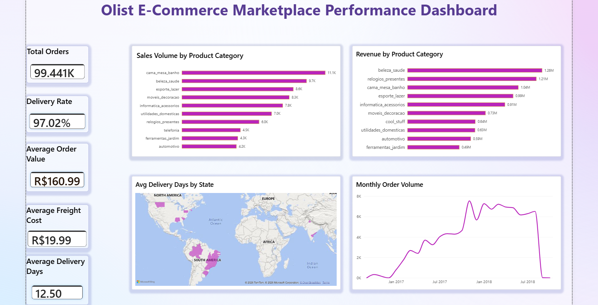

# Olist E-Commerce Marketplace Analysis

## Project Overview

This project analyses the Olist Brazilian e-commerce marketplace to understand performance across sales, revenue, customers, sellers, payments, and delivery.

The analysis was carried out using MySQL and Power BI. SQL was used to clean and analyse the data, answer business questions, and identify key findings. These findings were then used to build a one-page Power BI dashboard.

## Business Questions

The analysis focused on questions such as:

- Which product categories have the highest sales volume and revenue?
- Where are customers and sellers concentrated?
- Which payment methods are most commonly used?
- How effectively are orders being delivered?
- How long does delivery take across different states?
- How has order volume changed over time?

## Key Findings

- Cama Mesa Banho recorded the highest sales volume with **11,115 items**.
- Beleza Saúde generated the highest category revenue at **R$1,258,951**.
- São Paulo had the highest number of customers (**15,540**) and sellers (**694**).
- Credit card was the most-used payment method with **76,795 payments**.
- **97.02%** of orders were delivered successfully.
- Average delivery time was **12.50 days**.
- Roraima had the highest average delivery time at approximately **29.34 days**.
- Monthly order volume increased substantially through 2017 and remained around **6,000–7,000 orders per month** during most of 2018.

## Power BI Dashboard

The final dashboard includes:

- Total Orders
- Delivery Rate
- Average Order Value
- Average Delivery Days
- Average Freight Cost
- Sales Volume by Product Category
- Revenue by Product Category
- Average Delivery Days by State
- Monthly Order Volume

## Tools Used

- MySQL
- SQL
- Power BI

## Project Files

- **SQL Analysis:** `Olist_SQL_Analysis.sql`
- **Dashboard:** `Olist_Dashboard.png`
- **Documentation:** `Olist_Project_Documentation.pdf`
- **Power BI File:** Available through the project portfolio/Drive
